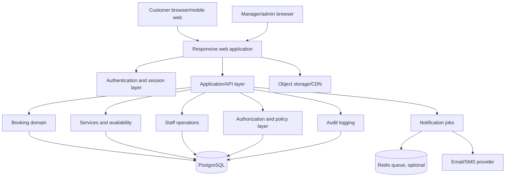

# Local Spa Platform — Architecture & Workflow Blueprint

## 1. Product vision

A secure, responsive booking and spa-management platform for a local spa offering massages, facials, body treatments, packages, and related services.

Guest booking is the default customer experience: a customer may book without creating an account. A customer account is optional and can be created after booking to manage future and past appointments. Manager and admin accounts are mandatory.

The system should serve three access levels:

- **User / Customer:** browse services, book appointments, manage their profile and bookings.
- **Manager / Staff:** manage day-to-day operations, schedules, bookings, customers, services, and reports.
- **Admin / Owner:** manage the entire platform, users, permissions, configuration, audit logs, and manager accounts.

### Recommended initial scope

Build the first version around one spa location, while keeping the data model extensible to multiple locations later.

### Primary success criteria

1. Customers can book an available service without staff intervention or mandatory registration.
2. Staff can reliably see and manage the schedule.
3. Double-booking is prevented at the database and application levels.
4. Managers and administrators cannot access more data or actions than their roles allow.
5. Sensitive operations are logged and recoverable.
6. The UI is calm, accessible, mobile-friendly, and easy for non-technical staff to use.

---

## 2. Recommended architecture

### 2.1 Application style

Use a **modular monolith** for version 1 rather than microservices.

This keeps deployment, testing, transactions, and maintenance simple while preserving clear boundaries between modules. The system can later extract notifications, payments, or reporting into services if the business grows.

### 2.2 Suggested stack

| Layer | Recommendation | Reason |
|---|---|---|
| Frontend | Next.js + React + TypeScript | Strong routing, server rendering, forms, and maintainability |
| UI | Tailwind CSS + accessible component primitives | Consistent responsive UI without excessive custom CSS |
| Backend | Express.js + TypeScript | Dedicated, testable API server with clear middleware and module boundaries |
| Database | PostgreSQL | Transactions, constraints, reliable relational modeling |
| ORM | Prisma or Drizzle | Type-safe database access and migrations |
| Validation | Zod shared between client and server | Prevent inconsistent input rules |
| Authentication | Secure cookie-based sessions, or a mature managed auth provider | Avoid custom password/session cryptography |
| Background jobs | Redis-backed queue only when needed | Reminders, email, cleanup, reports |
| File storage | Object storage for service images and documents | Avoid storing large files in PostgreSQL |
| Testing | Vitest/Jest + Playwright | Unit, integration, API, and end-to-end coverage |
| Observability | Structured logs, error tracking, uptime checks | Diagnose booking and security issues quickly |

**Important:** Do not implement password hashing, session tokens, email verification, or password reset cryptography from scratch. Use a mature authentication library or managed authentication service.

### 2.3 High-level component diagram



---

## 3. Domain modules

Keep each module responsible for its own rules, database queries, validation, and authorization checks.

```text
src/
  app/                       # Routes, layouts, pages, API entry points
  modules/
    auth/                    # Login, logout, registration, reset, sessions
    users/                   # Profiles, customer records, account state
    roles/                   # Role and permission policy definitions
    services/                # Treatments, categories, pricing, duration
    staff/                   # Staff profiles, working hours, time off
    availability/            # Slots, buffers, holidays, closure periods
    bookings/                # Booking lifecycle and conflict prevention
    payments/                # Reserved for a later phase; not in version 1
    notifications/           # Email/SMS templates and delivery jobs
    reports/                 # Operational summaries and exports
    audit/                   # Security and business audit events
    settings/                # Spa profile, policies, opening hours
  db/
    schema.prisma
    migrations/
    seed.ts
  lib/
    auth/
    db/
    validation/
    security/
    logging/
  components/
    ui/
    forms/
    booking/
    dashboard/
  tests/
    unit/
    integration/
    e2e/
  public/
  manus-routes.json
```

### Module boundary rule

A route handler must not contain all business logic. Route handlers should:

1. Authenticate the request.
2. Validate input.
3. Call an application service.
4. Return a safe response.

Business rules belong in domain/application services, where they can be tested without a browser.

---

## 4. Access model: User, Manager, Admin

### 4.1 Role capabilities

| Capability | User | Manager | Admin |
|---|:---:|:---:|:---:|
| Browse public services | Yes | Yes | Yes |
| Create own booking | Yes | Optional | Optional |
| View/edit own profile | Yes | Yes | Yes |
| View own booking history | Yes | Yes | Yes |
| Cancel/reschedule own booking | Policy-controlled | Yes | Yes |
| View all bookings | No | Yes | Yes |
| Create/edit services | No | Yes | Yes |
| Manage staff schedules | No | Yes | Yes |
| Manage customer records | Own only | Yes | Yes |
| View operational reports | No | Yes | Yes |
| Manage managers/admins | No | No | Yes |
| Change platform settings | No | Limited | Yes |
| View audit logs | No | Limited business logs | Yes |
| Delete/disable accounts | Own account request | Limited | Yes |
| Configure roles/permissions | No | No | Yes |

Use **permissions**, not only role names, internally. Roles should map to permissions so that future roles such as receptionist, therapist, or accountant can be added without rewriting authorization logic.

### 4.2 Authorization rules

Enforce authorization in three places:

1. **Route/API guard:** reject unauthenticated and unauthorized requests.
2. **Application service:** repeat the policy check before sensitive mutations.
3. **Database query scope:** constrain records by tenant/location/user ownership where applicable.

Never rely on hiding a button in the frontend as authorization.

### 4.3 Suggested permission names

```text
booking:create_own
booking:read_own
booking:update_own
booking:cancel_own
booking:read_all
booking:update_all
booking:cancel_all
service:read
service:write
staff:read
staff:write
schedule:write
customer:read
customer:write
report:read
settings:read
settings:write
user:manage
role:manage
audit:read
```

---

## 5. Core database design

Use UUIDs for public identifiers. Add `created_at`, `updated_at`, and where relevant `deleted_at` or `archived_at` fields.

### 5.1 Main tables

#### `users`

- `id`
- `email` — unique, normalized lowercase
- `phone` — normalized where possible
- `password_hash` — only if using local authentication
- `first_name`
- `last_name`
- `status` — active, suspended, pending_verification, deleted
- `email_verified_at`
- `last_login_at`
- `created_at`, `updated_at`

#### `roles`

- `id`
- `name` — user, manager, admin, or future roles
- `description`
- `is_system_role`

#### `user_roles`

- `user_id`
- `role_id`
- unique composite key on both fields

#### `permissions` and `role_permissions`

Store permission definitions and role-to-permission mappings. System roles should be protected from accidental deletion.

#### `customer_profiles`

- `user_id`
- `date_of_birth` — only if genuinely needed
- `preferred_contact_method`
- `consent_marketing`
- `notes` — access tightly restricted; avoid unnecessary medical data
- `emergency_contact` — only if operationally necessary

#### `services`

- `id`
- `category_id`
- `name`
- `slug`
- `description`
- `duration_minutes`
- `buffer_before_minutes`
- `buffer_after_minutes`
- `price_amount`
- `currency`
- `is_active`
- `image_url`
- `booking_policy`

#### `service_categories`

- `id`
- `name`
- `slug`
- `sort_order`
- `is_active`

#### `staff_profiles`

- `id`
- `user_id`
- `display_name`
- `bio`
- `is_bookable`
- `is_active`

#### `staff_services`

- `staff_id`
- `service_id`

#### `working_hours`

- `staff_id` or location-level owner
- `day_of_week`
- `start_time`
- `end_time`
- `timezone`

#### `time_off`

- `staff_id`
- `starts_at`
- `ends_at`
- `reason`
- `created_by`

#### `bookings`

- `id`
- `booking_reference` — human-friendly, unique
- `customer_id`
- `service_id`
- `staff_id` — nullable if staff assignment happens later
- `starts_at`
- `ends_at`
- `timezone`
- `status` — pending, confirmed, checked_in, completed, cancelled, no_show
- `customer_note`
- `staff_note` — hidden from customer
- `price_amount`
- `currency`
- `cancellation_reason`
- `created_by`
- `created_at`, `updated_at`

#### `booking_status_history`

- `booking_id`
- `from_status`
- `to_status`
- `changed_by`
- `reason`
- `created_at`

#### `payments` — reserved for a later phase

- `id`
- `booking_id`
- `provider`
- `provider_reference`
- `amount`
- `currency`
- `status`
- `paid_at`

#### `notifications`

- `id`
- `user_id`
- `booking_id`
- `channel` — email, SMS, in_app
- `template_key`
- `status` — queued, sent, failed
- `attempt_count`
- `sent_at`
- `last_error`

#### `audit_logs`

- `id`
- `actor_user_id`
- `action`
- `entity_type`
- `entity_id`
- `request_id`
- `ip_hash` or carefully controlled IP metadata
- `user_agent_summary`
- `metadata_json` — never store passwords, tokens, or payment secrets
- `created_at`

#### `spa_settings`

- `spa_name`
- `address`
- `timezone`
- `contact_email`
- `contact_phone`
- `cancellation_policy`
- `booking_window_days`
- `minimum_notice_hours`
- `default_currency`

### 5.2 Double-booking prevention

Availability must be calculated from:

- Staff working hours
- Staff time off
- Existing bookings
- Service duration and buffers
- Spa closure periods
- Minimum notice and maximum booking window

When creating a booking:

1. Start a database transaction.
2. Recalculate availability on the server.
3. Lock the relevant staff/time range or use a PostgreSQL exclusion constraint.
4. Insert the booking only if no overlap exists.
5. Commit the transaction.
6. Queue notifications after commit.

Do not trust a slot that was merely displayed in the browser. Two customers may select the same slot simultaneously.

---

## 6. Main user workflows

### 6.1 Customer booking workflow

```text
Home
  → Services
  → Service detail
  → Choose date and time
  → Choose therapist/staff, if applicable
  → Enter name, email, phone, and accept policies
  → Optionally sign in or create an account
  → Server rechecks availability
  → Create booking
  → Confirmation page
  → Confirmation email with secure management link
```

#### Booking UX requirements

- Show duration, price, preparation instructions, and cancellation policy before confirmation.
- Preserve form input if authentication is required mid-flow.
- Show clear timezone and local date/time.
- Avoid exposing whether another customer booked a particular slot in a way that leaks personal information.
- Provide a human-readable booking reference.
- Make the final confirmation idempotent to prevent duplicate bookings on refresh/double-click.

### 6.2 Guest booking and optional customer accounts

Customers should not be forced to register before booking. A guest booking collects name, email, phone, service, appointment time, and cancellation-policy acceptance.

After a guest booking, send a confirmation email containing a single-use, expiring, cryptographically random management token. Store only a hash of the token, rate-limit access attempts, make the token revocable, and never expose staff-only notes through guest access.

The confirmation page may offer an optional account-creation link. After email verification, link the new account to the existing customer profile and preserve booking history. Do not automatically merge customer records without verification.

### 6.3 Customer self-service workflow

Registered customer dashboard:

- Upcoming appointments
- Past appointments
- Reschedule or cancel, subject to policy
- Profile and contact preferences
- Notification preferences
- Online payment is intentionally excluded from version 1; customers pay at the spa.

Cancellation and rescheduling should create status history records and trigger notifications.

### 6.3 Manager workflow

Manager dashboard:

- Today’s appointments
- Calendar/day/week schedule
- Booking search and filters
- Check-in, complete, cancel, no-show
- Assign or reassign staff
- Customer contact details needed for operations
- Service and price management
- Staff availability and time-off management
- Operational reports

Managers should not manage administrator accounts, security policies, or role definitions.

### 6.4 Admin workflow

Admin dashboard:

- All manager capabilities
- User and role management
- Manager invitation/deactivation
- Spa settings and policies
- Audit log review
- Data export and retention controls
- Security events and failed-login overview
- System configuration

Require step-up authentication or re-authentication for high-risk actions such as changing roles, disabling an administrator, or modifying security settings.

---

## 7. API design

Use REST or typed RPC consistently. The following REST-style endpoints are a useful baseline.

### Public/customer endpoints

```text
POST   /api/auth/register
POST   /api/auth/login
POST   /api/auth/logout
POST   /api/auth/forgot-password
POST   /api/auth/reset-password
GET    /api/services
GET    /api/services/:slug
GET    /api/availability?serviceId=&date=&staffId=
POST   /api/bookings
GET    /api/me
GET    /api/me/bookings
PATCH  /api/me/bookings/:id
POST   /api/me/bookings/:id/cancel
PATCH  /api/me/profile
```

### Manager endpoints

```text
GET    /api/manager/bookings
PATCH  /api/manager/bookings/:id/status
PATCH  /api/manager/bookings/:id/assign-staff
GET    /api/manager/customers
GET    /api/manager/staff
PATCH  /api/manager/staff/:id
POST   /api/manager/time-off
GET    /api/manager/reports/summary
POST   /api/manager/services
PATCH  /api/manager/services/:id
```

### Admin endpoints

```text
GET    /api/admin/users
PATCH  /api/admin/users/:id/status
POST   /api/admin/managers/invite
PATCH  /api/admin/users/:id/roles
GET    /api/admin/audit-logs
GET    /api/admin/settings
PATCH  /api/admin/settings
```

### API rules

- Validate every request body, query parameter, and path parameter.
- Return generic authentication errors to avoid account enumeration.
- Use pagination and bounded filters on list endpoints.
- Never return password hashes, reset tokens, internal secrets, or unnecessary private notes.
- Use consistent error codes such as `VALIDATION_ERROR`, `UNAUTHORIZED`, `FORBIDDEN`, `NOT_FOUND`, `CONFLICT`, and `RATE_LIMITED`.
- Add request IDs to logs and error responses.
- Apply rate limits per IP and per account to login, password reset, registration, and booking creation.

---

## 8. Security architecture

### 8.1 Authentication

- Use secure, HTTP-only cookies for browser sessions.
- Set `Secure` in HTTPS environments and an appropriate `SameSite` policy.
- Rotate sessions after login and privilege changes.
- Expire inactive sessions and provide logout-from-all-devices.
- Use strong password hashing such as Argon2id through a trusted library.
- Require email verification if accounts are created online.
- Use single-use, expiring password-reset tokens.
- Add optional or mandatory MFA for managers and admins.
- Implement login throttling and temporary lockout/risk controls.

### 8.2 Authorization

- Deny by default.
- Check permissions server-side on every protected operation.
- Enforce ownership: a customer can read or mutate only their own records.
- Separate customer-visible notes from staff-only notes.
- Protect admin routes at both layout and API levels.
- Require re-authentication for privilege and security changes.

### 8.3 Application security

- CSRF protection for cookie-authenticated state-changing requests.
- Strict input validation and output encoding.
- Parameterized queries through the ORM.
- Content Security Policy and security headers.
- Clickjacking protection with `frame-ancestors` policy appropriate to deployment.
- File upload restrictions: allowlisted MIME types, size limits, generated filenames, malware scanning where available, and storage outside the application server.
- Do not render user-provided HTML without sanitization.
- Do not expose stack traces or SQL errors to users.
- Keep secrets in environment variables/secret storage, never in source control.
- Encrypt backups and restrict production database access.

### 8.4 Privacy and data minimization

A spa usually does not need detailed medical records. Avoid collecting health information unless there is a clear operational/legal requirement.

- Collect only information necessary for booking and customer care.
- Define retention periods for old customer data, audit data, and logs.
- Provide account/data deletion or anonymization processes where applicable.
- Record consent separately for marketing communications.
- Restrict access to private customer notes.
- Never log full payment card data, passwords, session cookies, or reset tokens.

### 8.5 Operational security

- Separate development, staging, and production databases.
- Run migrations through controlled deployment steps.
- Use least-privilege database credentials.
- Back up PostgreSQL automatically and test restoration.
- Monitor failed logins, privilege changes, repeated booking conflicts, and unusual export activity.
- Maintain an incident-response procedure and administrator contact list.

---

## 9. UI/UX direction

### Design movement

**Quiet luxury / modern wellness editorial.** The interface should feel calm and premium without becoming decorative or difficult to use.

### Core principles

1. **Calm hierarchy:** generous spacing, clear sections, limited competing calls to action.
2. **Trust through clarity:** visible price, duration, policies, and booking status.
3. **Warm professionalism:** soft natural colors paired with strong readable typography.
4. **Operational speed:** staff workflows should prioritize scanning and fast status changes.

### Color philosophy

Use a warm ivory background, deep charcoal text, muted sage/olive surfaces, and one ownable terracotta or copper accent for action states. The palette should communicate relaxation while preserving enough contrast for accessibility.

### Typography system

- Display: an elegant serif such as **DM Serif Display** or **Cormorant Garamond**.
- Interface/body: a highly legible sans-serif such as **Inter**, **Manrope**, or **Source Sans 3**.
- Use the serif only for brand moments and major headings; keep forms, calendars, prices, and dashboards in the sans-serif.

### Layout paradigm

Use an editorial, asymmetric layout on the marketing pages, but a dense, utility-first layout inside staff dashboards. Do not force the dashboard into the same visual rhythm as the public site.

### Signature elements

- Soft rounded service cards with treatment duration and price visible at a glance.
- A copper accent line or pill used for selected dates, confirmed bookings, and primary actions.
- Subtle botanical or stone-inspired texture only in low-contrast marketing areas; never behind form fields.

### Interaction and animation

- Use short, quiet transitions around 150–220ms.
- Animate booking progress and confirmation states, not every hover.
- Preserve visible focus states for keyboard users.
- On mobile, make date/time selection thumb-friendly and keep the confirmation CTA sticky only when it does not obscure content.
- In staff screens, favor immediate feedback and optimistic UI only where rollback is safe; booking status changes should confirm server success.

### Ethical conversion and marketing layout

Optimize the public site for ethical persuasion: clear value, authentic trust, low-friction guest booking, and one dominant booking action. Do not use fake scarcity, invented reviews, misleading countdowns, hidden fees, forced registration, manipulative consent, or obstructive cancellation flows.

The brand position is **a calm, trusted local spa that turns a busy day into a deliberate pause through expert treatments and thoughtful service**. The personality is warm, refined, and reassuring.

Recommended color tokens:

| Token | Hex | Use |
|---|---|---|
| Ivory | `#F7F3EE` | Main background |
| Paper | `#FFFCF8` | Cards and booking panels |
| Charcoal | `#252321` | Primary text |
| Warm gray | `#716B65` | Secondary text |
| Sage | `#DDE2D6` | Calm surfaces |
| Deep sage | `#667260` | Supporting accents |
| Copper | `#A86F4A` | Primary action and active states |
| Copper dark | `#7E4D32` | Hover states and accessible emphasis |
| Line | `#DED7CE` | Borders |

The homepage should use this narrative order: emotionally specific hero; single primary Book an appointment CTA; trust strip; three to five signature treatments with duration and price; expertise/personalization/atmosphere benefits; real testimonials; three-step booking explanation; location and practical details; final booking CTA; contact, privacy, policies, accessibility, and social links in the footer.

Every treatment page should explain the expected outcome, ideal customer, duration, price, preparation, aftercare, therapist information where available, cancellation policy, and the next available booking action.

Use authentic social proof only. Show real local address, opening hours, contact details, parking/transit guidance, and accurate reviews. Make the guest path obvious with microcopy such as “No account required.”

For local SEO, add unique metadata, canonical URLs, Open Graph previews, accurate LocalBusiness/service structured data, sitemap, robots rules, natural city/service language, accessible alt text, optimized image formats, and consistent business name/address/phone information.

Track privacy-respectful funnel events such as service views, booking CTA clicks, booking starts, service/date/time selection, guest-detail submission, booking completion, conflicts, and abandonment. Obtain consent before non-essential analytics and never record sensitive customer notes.

### Suggested public pages

```text
/
/services
/services/:slug
/book
/about
/contact
/policies
/login
/register
/forgot-password
```

### Suggested authenticated pages

```text
/account
/account/bookings
/account/profile
/manager
/manager/calendar
/manager/bookings
/manager/customers
/manager/services
/manager/staff
/manager/reports
/admin
/admin/users
/admin/roles
/admin/audit-logs
/admin/settings
```

---

## 10. Booking state machine

Use explicit transitions rather than allowing arbitrary status edits.

```text
pending → confirmed → checked_in → completed
pending → cancelled
confirmed → cancelled
confirmed → no_show
checked_in → completed
```

Rules:

- A customer may cancel/reschedule only while policy allows it.
- A manager may mark check-in, completion, cancellation, or no-show.
- An admin may correct exceptional records, but the correction must be audited.
- Every transition records actor, timestamp, previous state, new state, and reason when applicable.

---

## 11. Notifications

Start with email; add SMS only after the core booking flow is stable.

### Events

- Account verification
- Welcome/account creation
- Booking created
- Booking confirmed
- Booking rescheduled
- Booking cancelled
- Reminder 24 hours before appointment
- Reminder 2 hours before appointment, optional
- Staff assignment changed
- Password reset
- Manager invitation

Notifications should be asynchronous and retryable. A failed email must not roll back a successful booking.

Use templates with escaped customer data and a clear unsubscribe mechanism for marketing-only messages.

---

## 12. Reporting and admin observability

### Manager reports

- Appointments today/this week
- Revenue by day/service, if payments are integrated
- Cancellation and no-show rate
- Most-booked services
- Staff utilization
- New versus returning customers

### Admin security views

- Failed login attempts
- New manager/admin accounts
- Role changes
- Account suspensions
- Large exports
- Repeated booking conflicts
- Audit events by actor and date

Exports must be permission-protected, paginated/streamed, and audited.

---

## 13. Testing strategy

### Unit tests

Cover:

- Role-to-permission rules
- Booking policy and cancellation windows
- Availability calculation
- Timezone conversion
- Booking state transitions
- Input validation
- Price and duration calculations

### Integration tests

Cover:

- Registration/login/logout
- Customer ownership restrictions
- Manager/admin authorization boundaries
- Booking transaction conflict behavior
- Time-off and working-hour effects
- Notification enqueueing after successful booking
- Audit log creation for sensitive operations

### End-to-end tests

Cover the critical journeys:

1. Customer registers and books an appointment.
2. Customer reschedules or cancels within policy.
3. Manager confirms/checks in/completes a booking.
4. Admin invites a manager and changes a role.
5. Two users attempt the same slot and only one booking succeeds.
6. An unauthorized user cannot open or call staff/admin operations.

### Security verification

- Dependency vulnerability scans
- Secret scanning
- Static analysis/type checking
- Rate-limit tests
- Session/cookie checks
- CSRF checks
- Access-control matrix tests
- Backup restoration test before production launch

---

## 14. Delivery roadmap

### Phase 0 — Discovery and decisions

- Confirm spa name, location, timezone, services, prices, duration, opening hours, cancellation policy, and staff model.
- Decide whether customers pay online, pay a deposit, or pay at the spa.
- Confirm email/SMS provider and deployment target.
- Confirm any privacy, consent, or local regulatory requirements.

### Phase 1 — Foundation

- Create repository and environment configuration.
- Set up TypeScript, database, migrations, ORM, validation, linting, and testing.
- Implement authentication, sessions, password reset, and initial role/permission model.
- Add error handling, logging, request IDs, and security headers.

### Phase 2 — Catalog and public site

- Build service categories and service detail pages.
- Add spa profile, contact, policies, and responsive marketing UI.
- Add service images through controlled storage.

### Phase 3 — Availability and booking

- Implement working hours, time off, availability calculation, booking transactions, and state history.
- Build customer booking flow and account dashboard.
- Add confirmation and cancellation notifications.

### Phase 4 — Staff operations

- Build manager calendar and booking list.
- Add check-in, completion, cancellation, no-show, assignment, customer lookup, service management, and reports.

### Phase 5 — Administration and hardening

- Build admin user/role management, settings, audit logs, export controls, and security event views.
- Add MFA for privileged roles.
- Complete access-control tests, backup restoration, dependency review, and deployment runbook.

### Phase 6 — Optional expansion

- Online deposits/payments (later phase; excluded from version 1)
- SMS reminders
- Gift cards and packages
- Memberships
- Multi-location support
- Customer reviews
- Loyalty program
- Native mobile app or PWA enhancements

---

## 15. Recommended implementation order inside the codebase

1. Database schema and migration foundation.
2. Authentication and session handling.
3. Permission policy engine and route guards.
4. Service catalog.
5. Staff schedules and availability calculation.
6. Booking transaction and state machine.
7. Customer-facing booking UI.
8. Manager calendar and operations.
9. Notifications.
10. Admin controls and audit logs.
11. Reports and future payment integration when the business is ready.
12. Hardening, testing, deployment, and backup restoration.

This order minimizes rework because booking depends on users, services, staff availability, authorization, and transactional persistence.

---

## 16. Definition of done for the first production release

The first release is ready only when:

- User, manager, and admin roles are enforced server-side.
- Customer records are ownership-scoped.
- Booking overlap is prevented under concurrent requests.
- All sensitive mutations are audited.
- Passwords, sessions, reset tokens, and payment data are handled safely.
- Staff can complete the day-to-day booking workflow without database access.
- The public site and dashboards are responsive and keyboard accessible.
- Backups have been restored successfully in a test environment.
- Critical customer, manager, admin, and concurrency journeys pass automated tests.
- Production secrets, logging, rate limits, monitoring, and rollback procedures are configured.

---

## 17. Decisions still needed before implementation

These are the only choices that materially affect the next build step:

1. **Single location or multiple locations at launch?**
2. **Customer payment:** version 1 uses no online payment; customers pay at the spa.
3. **Staff assignment:** customer chooses a therapist, or the manager assigns one?
4. **Communication:** email only, or email plus SMS?
5. **Authentication:** password plus email verification, social login, or both?
6. **Deployment preference:** managed platform services or a plain local/custom stack?
7. **Brand inputs:** spa name, logo, colors, service list, prices, photos, and tone.

A sensible default for version 1 is: **one location, Express.js + TypeScript backend, email confirmation, no online payment, manager-assigned staff, password plus email verification, and PostgreSQL.**
