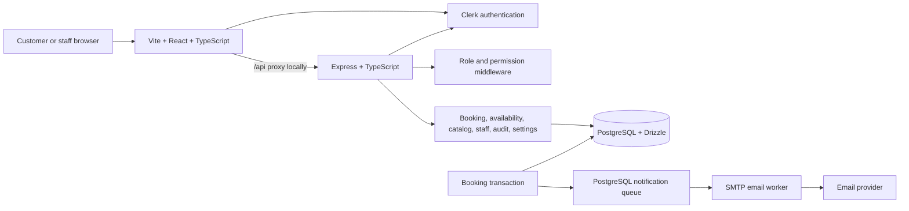
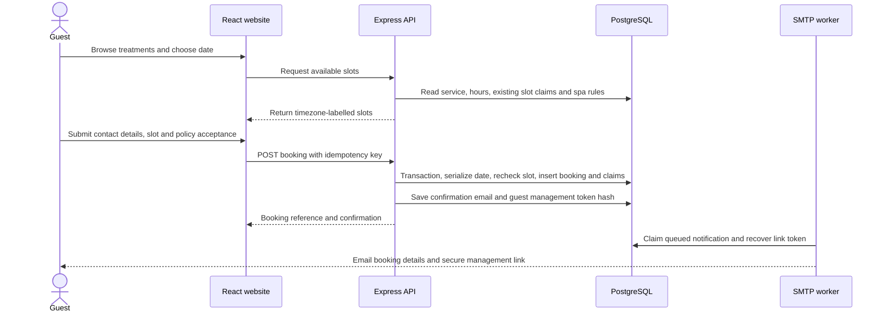

# Local Spa Platform: Blueprint Review and Workflow

**Review date:** 4 October 2026  
**Compared against:** the supplied “Local Spa Platform — Architecture & Workflow Blueprint” and the checked-in application source.

This document records what the repository implements today, where it only partially meets the blueprint, and a practical order for the remaining work. It is a source review, not a production-readiness certification: deployment configuration, live Clerk settings, SMTP delivery, database operations, and browser behavior still need environment-specific verification.

## Summary

The repository is a working **single-location, guest-first booking and spa operations application**. Its main path—public catalog, availability, guest booking, manager booking operations, and email notifications—has real API and database implementations. It uses a different but reasonable stack from the blueprint: Vite/React instead of Next.js, Clerk instead of custom sessions, and Drizzle instead of Prisma. Those are implementation choices, not missing features.

It is **not yet the full product or ready to treat as a production launch**. The most important gaps are a complete customer account experience backed by server data, working-hours/time-off administration and a calendar view, admin account/settings/permission workflows, production-grade operations and security hardening, and end-to-end/concurrency/access-control coverage. Seed business content and policy text are still demo values.

### Status at a glance

| Area | Status | What is present |
|---|---|---|
| Public spa pages and catalog | Implemented, demo content | Home, services, detail, policies/privacy, profile and catalog APIs. |
| Arabic/English/French interface | Partial | Language switch, document `lang`/direction, Arabic font/RTL support, and dictionary. Some fixed UI copy and business-supplied content are not translated. |
| Availability and guest booking | Implemented, capacity-model decision needed | Timezone-aware slots, server recheck, transaction, idempotency, slot claims, booking reference and confirmation. Claims represent one global appointment capacity per time. |
| Guest booking self-service | Implemented, limited | Expiring email link can review or cancel; cancellation consumes the link. No reschedule or link reissue/revocation flow. |
| Customer accounts | Partial | Clerk sign-in/up and verified-email linking exist. Account profile/history currently use browser local storage; there are no server-backed own-booking/profile endpoints. |
| Manager operations | Partial to implemented | Daily dashboard, booking status transitions, staff assignment, services, staff directory and customer records. No calendar, configurable schedules/time off, or broad reports. |
| Admin operations | Partial | Admin can use manager operations and read a bounded audit list. No dedicated admin console for users, roles, platform settings, exports or security events. |
| Authentication and authorization | Implemented foundation | Clerk verification, centralized role-to-permission policy, permission middleware, protected APIs. Permission definitions are code/Clerk metadata rather than a database registry. |
| Notifications | Partial | PostgreSQL queue and retrying SMTP worker; booking-created/confirmed/cancelled email templates. SMTP is optional and is disabled in sample configuration. No SMS or reminder scheduler. |
| Audit | Partial | Booking and management audit writes; admin/business read routes return up to 100 recent items. No pagination, export, security-event view or retention controls. |
| Automated verification | Partial | A small set of unit tests exists. No checked-in full API integration, browser E2E, concurrent-booking, or production security verification suite. |
| Production operations | Not complete | Local setup guides and Docker PostgreSQL are present. Production migrations/rollback, shared rate limiting, monitored backups/restore drills, deployment/runbook and observability controls remain. |

## Architecture in this repository

The API is a modular monolith, consistent with the blueprint’s recommendation. Runtime database schema is Drizzle under `api/src/db/src/schema`; `api/prisma/schema.prisma` is reference-only and is not the runtime migration source. Shared Zod contracts and generated React Query hooks connect the web and API.

## Implemented workflows

### Public booking and confirmation

The public endpoints are `/api/spa`, `/api/services`, `/api/services/:slug`, `/api/availability`, and `/api/bookings`. Booking input is validated. The server derives the spa timezone, recalculates availability, takes a PostgreSQL transaction advisory lock for the local date, and writes unique slot claims. The idempotency key lets retries return the existing confirmation. The database claim constraint is the final overlap guard.

**Capacity decision to settle:** slot claims are unique globally by time, not by therapist. This safely enforces one booking at a time for each claimed interval. If simultaneous appointments with different therapists are intended, the capacity model must be changed to reserve a specific staff member or a defined capacity pool. Staff assignment currently happens separately in operations.

### Guest booking management

The notification includes a time-limited management link when `PUBLIC_APP_URL` is configured. The server stores a hash of the bearer token, sets `Cache-Control: no-store` and `Referrer-Policy: no-referrer` on link APIs, rate-limits read and cancel endpoints per API process, and omits query strings from request logs. The link can read a booking and cancel a future pending/confirmed booking. Cancellation updates status/history/audit, releases slot claims, queues an email, and marks the token used.

This currently provides **review and cancel**, not rescheduling. A read does not consume the token; successful cancellation does. There is no customer-facing way to resend or revoke a link. The raw bearer appears in the link query string, so production hosting, browser analytics, proxy logging, and referrer behavior should be reviewed together even with the safeguards above.

### Customer accounts

Clerk provides sign-in/sign-up. A booking is linked to a Clerk account only if the submitted email matches a verified email. `/api/auth/link-customer` can link a matching guest record after sign-in and verified primary-email checks.

The current account page is not a complete account service: saved contact data and booking history are kept in browser local storage. The API does not expose ownership-scoped customer profile or booking-history routes, and this local history will not follow a customer between devices. Account linking is therefore not yet a dependable server-backed history migration.

### Manager and admin workflows

Manager endpoints under `/api/manager` are permission guarded. The UI provides a daily overview, date-filtered bookings, allowed booking status transitions, staff assignment, service management, staff directory/account editing, customer lookup/editing, and a business-audit view. Service deletion is implemented as deactivation. Sensitive management writes include audit events.

An admin inherits manager capabilities and can view `/api/admin/audit-logs` and `/admin/audit-logs`. Role assignment is currently provisioned through Clerk metadata and the trusted `grant-role` script; the checked-in UI does not provide a dedicated admin user/role-management console. Some staff account workflows exist in the staff-management panel, but they do not replace a complete administrator workflow for manager/admin invitations, role governance, platform settings, exports, and security events.

## Blueprint coverage by topic

### Product and data model

- **Present:** one spa settings record; services and categories; staff profiles; customer records; bookings; booking status history; slot claims; hashed guest token records; queued notifications; audit events. Currency, timezone, booking window and minimum notice are represented.
- **Partial:** working hours are location-wide weekly rows and are consumed by availability, but no manager/admin editor is exposed. Staff-to-service associations exist in the schema, but the public booking flow does not let a customer choose a therapist and the global capacity claim does not reserve one.
- **Missing:** multiple locations/tenant scoping, staff time-off, closure periods/holidays, explicit customer profile/preferences/marketing consent, staff-only booking notes, payment records (intentionally later), retention/archival fields and a database-backed roles/permissions registry.
- **Decision:** keep one location for the first release as the blueprint recommends unless the business confirms otherwise. No online payment is wired, consistent with the V1 recommendation.

### Authorization and security

- **Present:** Clerk handles identity; the API checks authenticated users and effective permissions for protected routes; unknown roles fall back to customer role; manager metadata is filtered from administrator-only permissions; role changes through staff management clear the local permission cache. The API does not rely on frontend button hiding as its only guard.
- **Partial:** custom permissions can be stored in Clerk public metadata, but there is no permission administration interface or DB registry. The role lookup cache lasts 30 seconds. Some account administration is mixed into staff management. Public rate limits use in-process memory and must be replaced/shared for multiple API instances.
- **Needs security review before launch:** API CORS currently reflects request origins while allowing credentials; assess and restrict allowed origins for deployment. The Express setup shown does not add a security-header/CSP middleware or an explicit CSRF strategy. Confirm Clerk cookie/origin behavior, proxy configuration, cookie/session settings, production TLS, and request/body limits in the deployment environment. Assess step-up authentication for privileged changes, dependency/secret scanning, and database least privilege.
- **Privacy:** collect only necessary booking details. Document actual collection, provider sharing, retention, deletion/anonymization and access practices; current privacy page is explicitly a template. Do not treat it as a final policy.

### Operations, notifications and observability

- **Present:** asynchronous SMTP queue processing, retries, email templates for booking request/confirmation/cancellation, structured Pino HTTP logging with query strings excluded, health endpoint, booking status history and audit events.
- **Partial:** SMTP delivery requires deployment configuration; with no SMTP configuration the worker stays off and queued email is not delivered. There are no scheduled 24-hour/two-hour reminders, SMS, admin failed-login dashboard, report exports, paginated audit search, alerting or documented incident/restore exercise.
- **Missing:** deployment-specific monitoring/error tracking, production database migration/rollback workflow, tested backup restoration, data-retention procedures and a production runbook.

### UI and accessibility

- **Present:** responsive public site and operational pages, service detail, booking form, policy/privacy pages, language selector, theme control and a set of accessible UI primitives.
- **Partial:** Arabic direction/font support and interface translation exist but untranslated literals remain in public, account, manager and policy flows; database-provided service/profile text is not automatically translated. Review RTL spacing/icons, screen-reader labels, focus states, contrast, keyboard paths, mobile overflow, form errors, and localization of displayed dates/currency. French translations also need a completeness/content review.
- **Partial:** manager day view is useful for basic operations but is not a day/week calendar. Booking flow displays date/time and the configured timezone is used for slot labels, but the timezone and preparation details should be made more prominent and consistent.

### Testing and quality

The repository has unit tests for permission mapping, rate limiting, and service validation. This is a start, not the blueprint’s requested coverage. Add focused tests for time-zone/DST availability, slot claims under simultaneous requests, idempotent retries, booking status transitions, guest token expiry/reuse/cancel policy, verified-email linking and cross-role access boundaries. Then add API integration and browser E2E journeys for guest booking, guest cancellation, manager operations, and unauthorized requests. Add security checks and restore verification before production. No full test suite or runtime integration audit was performed for this report.

## Main workflows and current boundaries

| Workflow | Current path | Main limitation |
|---|---|---|
| Browse and book as guest | Home → services → detail/book → choose date/time → contact/policy → confirmation | Spa-supplied text is not translated automatically; no customer-selected therapist. |
| Manage guest booking | Email link → booking summary → cancel | No reschedule/reissue; cancellation is unavailable after appointment start and only for pending/confirmed. |
| Use a customer account | Clerk sign-in/up → browser account page | Booking history/profile are browser-local, not cross-device server data; ownership APIs missing. |
| Run the spa day | Staff sign-in → `/manager` → daily bookings → assign staff/update status | No calendar, schedule/time-off editor, full reports or configurable hours. |
| Administer platform | Admin role → manager area and audit page; trusted role script | No complete admin console, settings editor, invitation flow, permission UI, exports or security event dashboard. |
| Receive booking email | Booking saved → DB queue → SMTP worker → recipient | Requires SMTP and public URL config; no reminder schedule or SMS. |

## Recommended work order

### P0 — Resolve before accepting real bookings

1. Replace every seed business name, service, price, opening hour, contact, timezone and cancellation policy with approved values. Complete and review privacy/cancellation disclosures.
2. Decide appointment capacity and therapist assignment: single global slot, staff-specific booking, or explicit parallel capacity. Update claims and availability before launch if global one-at-a-time capacity is not correct.
3. Configure production Clerk, `PUBLIC_APP_URL`, a 32-byte-or-longer `GUEST_BOOKING_MANAGEMENT_SECRET`, SMTP credentials and HTTPS. Confirm an end-to-end booking email and guest cancellation in the target environment.
4. Restrict credentialed CORS to known origins; define and verify production CSRF, security headers/CSP, TLS/proxy trust, request limits, secret storage, database privileges and rate-limit strategy.
5. Establish controlled production migrations/rollback, automated encrypted backups and a successful restore drill; create a deployment and incident runbook.

### P1 — Close core customer and staff workflow gaps

1. Add server-backed, ownership-scoped `/me` profile and booking-history APIs; move customer account history off local storage and test verified linking without silently merging unverified records.
2. Add manager-editable opening hours, staff-service eligibility, time off and closure periods, with validation that prevents invalid or overlapping availability.
3. Build a usable day/week calendar and booking search/filter workflow for staff; retain audited status transitions and conflict-aware assignment.
4. Decide and implement guest rescheduling or explicitly keep cancellation-only as a product policy; add safe link resend/revoke behavior if customers need it.
5. Complete static UI translation and RTL audit across sign-in, policies, booking confirmation, account and staff/admin panels. Define how business-authored service content should be supplied in multiple languages.

### P2 — Complete administration and operational visibility

1. Add dedicated admin account/manager invitation, disable, role and permission workflows with protections against removing the last admin and step-up authentication for high-risk actions.
2. Add a controlled spa settings editor and audited data export/retention controls.
3. Add paginated/filterable audit history and security views for role changes, disabled accounts, failed auth signals, export activity and repeated booking conflicts.
4. Add operational summaries (appointments, cancellations/no-shows, service/staff utilization); only report revenue if payment/accounting data supports it.
5. Add reminder jobs and delivery monitoring if email reminders are confirmed as a business requirement; add SMS only after provider/cost decisions.

### P3 — Prove reliability and prepare deployment

1. Add unit, API integration, end-to-end and concurrent-booking tests listed above; include keyboard/screen-reader and RTL browser checks.
2. Add CI for typecheck/build/tests, dependency and secret scanning, and deployment smoke checks.
3. Add shared rate-limit storage before horizontal scaling, production monitoring/error tracking, alerting and tested recovery procedures.
4. Revisit multi-location, payments, packages, memberships, object storage and other expansion only when the business needs them.

## Product decisions still needed

The blueprint asks these questions; the source code does not settle them all:

1. Is V1 definitely one location?
2. Should a customer choose a therapist, should staff assign one, or should an unassigned appointment consume a single global slot? Can therapists serve bookings in parallel?
3. Is cancellation-only guest self-service acceptable, or is rescheduling required? What are the cancellation deadlines and link lifetime policy?
4. Are customer payments always in person for V1? (No online payments are currently implemented.)
5. Which SMTP/email provider, reminder timing and sender identity should be used? Is SMS needed?
6. Which business-approved service text/translations, brand assets, hours, contact details, privacy/cancellation terms and retention periods should replace seed values?
7. What deployment target and operational owner will provide PostgreSQL, secrets, TLS, backups, monitoring and incident response?

## Repository map

| Concern | Main source paths |
|---|---|
| Public UI and booking/account pages | `web/components/SpaPages.tsx`, `web/app/App.tsx` |
| Language and translations | `web/lib/i18n.tsx`, `web/app/index.css` |
| HTTP app and routing | `api/src/app.ts`, `api/src/routes/` |
| Role/permission policy | `api/src/modules/auth/authorization.ts` |
| Booking and availability | `api/src/modules/bookings/`, `api/src/modules/availability/`, `api/src/modules/shared/time.ts` |
| Guest bearer links | `api/src/modules/guest-bookings/`, public routes in `api/src/routes/public.ts` |
| Manager operations and management | `api/src/modules/staff/`, `api/src/routes/manager.ts` |
| Notifications and audit | `api/src/modules/notifications/`, `api/src/modules/audit/` |
| Runtime schema and setup | `api/src/db/src/schema/`, `docs/database-guide.md`, `docs/running-guide.md` |
| Shared API contracts | `api/src/contracts/`, `web/lib/api-client-react/` |

## Existing documentation to reconcile

The checked-in guides predate some current behavior. In particular, `docs/system-description.md` and `docs/use-guide.md` say guest booking management is unavailable, while the current public routes and UI implement secure-link review and cancellation. Those guides also describe customer account capabilities more broadly than the browser-local implementation warrants. Update those docs alongside the code as workflows change; this review is the current status snapshot.

